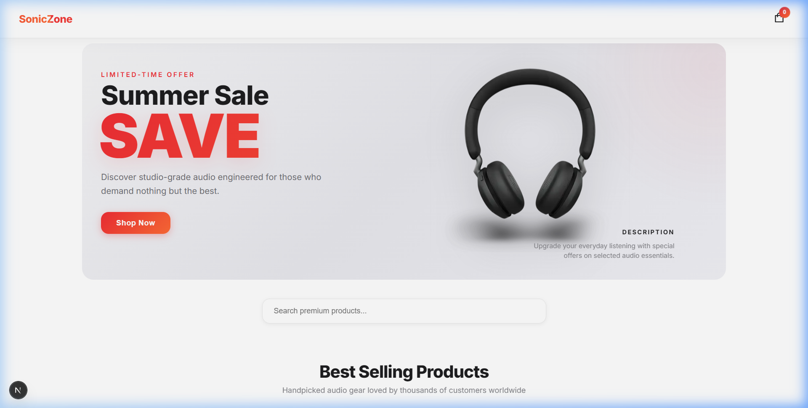
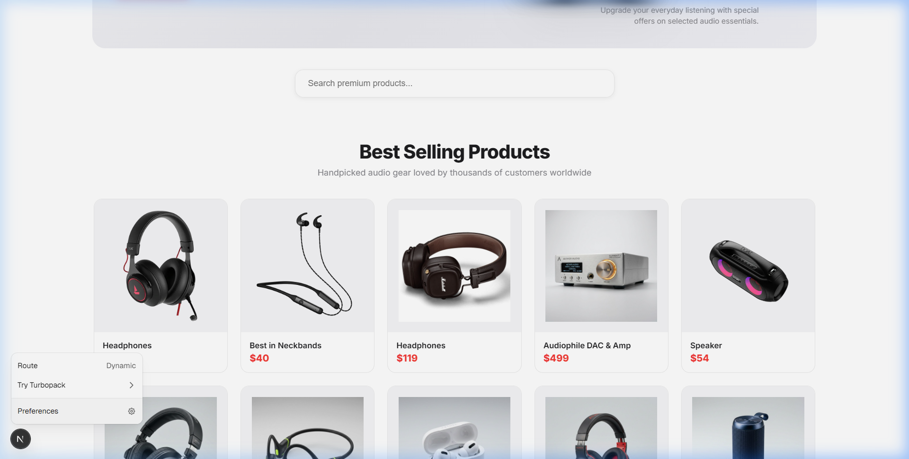
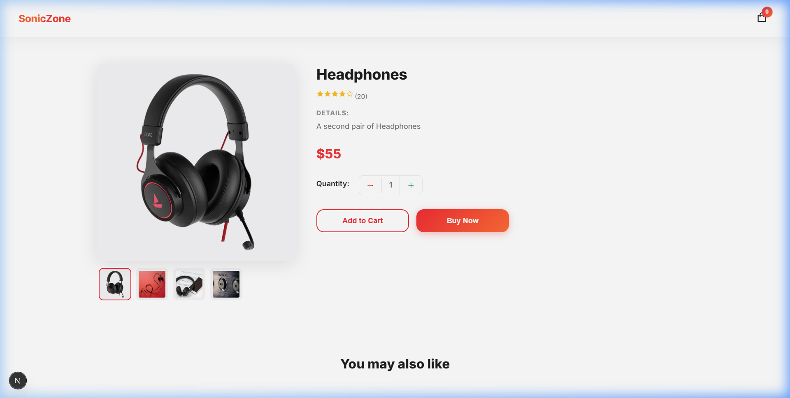

# 🎧 SonicZone: A Modern Audio Commerce Experience

**SonicZone** is a full-stack, responsive ecommerce application built to deliver a seamless shopping experience for premium audio gear. 

I built this project because I wanted to understand how a real-world online store works from end to end—from fetching dynamic product data via a headless CMS, to managing complex shopping cart state, and finally securely processing payments. 

## 📸 See It In Action

<div align="center">
  
  
</div>
<div align="center">
  
  
</div>

## 🛠 Tech Stack

- **Framework:** [Next.js](https://nextjs.org/) (React)
- **Content Management:** [Sanity CMS](https://www.sanity.io/)
- **Payments:** [Stripe Checkout](https://stripe.com/)
- **State Management:** React Context API
- **Styling:** Vanilla CSS (Custom Responsive Layouts)

## ✨ Key Features

- **Headless CMS Integration:** The entire product catalog and promotional banners are driven by Sanity. I can update prices, stock, or launch a "Summer Sale" without touching a single line of code.
- **Lightning Fast Search:** A custom, debounced (300ms) real-time search bar that filters products instantly as you type.
- **Global Cart State:** Implemented a robust React Context provider to manage cart operations (add, remove, quantity adjustments) across the entire application.
- **Secure Checkout:** Integrated Stripe Checkout to handle payments securely, ensuring no sensitive credit card data ever hits our servers.
- **Optimized Rendering:** Uses Server-Side Rendering (SSR) and Static Site Generation (SSG) to ensure lightning-fast page loads and fresh data.
- **Subtle, Premium Animations:** Added custom CSS `@keyframes` (`fadeInUp`) for a polished, professional feel as users scroll.

## 🧠 Challenges & Learnings

Building this wasn't just about putting components together; it was about solving real e-commerce problems:

1. **State Management:** I initially struggled with passing cart state between deeply nested components. Implementing the React Context API was a game-changer, allowing the Navbar, Product pages, and Cart drawer to stay perfectly synced.
2. **Handling Images:** Sanity stores images as reference strings, but Stripe needs a public URL for its checkout page. I learned how to use Sanity's image URL builder to dynamically generate optimized CDN links on the fly before passing data to the Stripe API.
3. **API Routes:** I learned how to safely handle sensitive operations (like initializing Stripe sessions with secret keys) using Next.js API routes, keeping the client-side code secure.

## 🚀 Getting Started

Want to run this locally? It's easy:

1. **Clone the repo:**
   ```bash
   git clone https://github.com/saketmathur04/EternoStore.git
   cd EternoStore
   ```
2. **Install dependencies:**
   ```bash
   npm install
   ```
3. **Set up Environment Variables:**
   Create a `.env` file in the root and add your keys:
   ```env
   NEXT_PUBLIC_SANITY_TOKEN=your_sanity_token
   NEXT_PUBLIC_STRIPE_PUBLISHABLE_KEY=your_stripe_publishable_key
   STRIPE_SECRET_KEY=your_stripe_secret_key
   ```
4. **Run the development server:**
   ```bash
   npm run dev
   ```
   Open `http://localhost:3000` to view it in the browser.

## 👨‍💻 About Me

Hi, I'm **Saket Mathur**, a 4th-year BTech Computer Science student passionate about building scalable, user-centric web applications. 

If you're a recruiter or engineering manager, I'd love to connect! 

[GitHub](https://github.com/saketmathur04) | [LinkedIn](https://linkedin.com/in/saketmathur)
