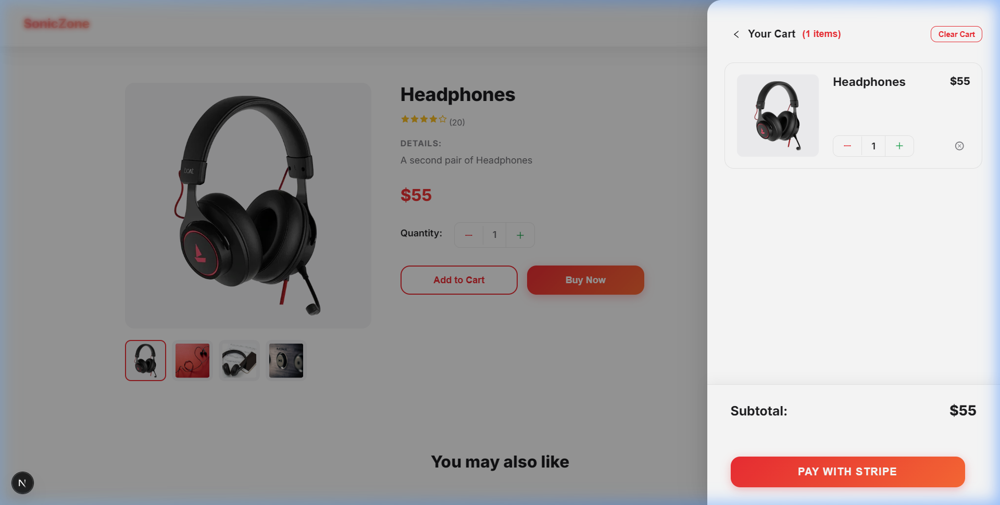
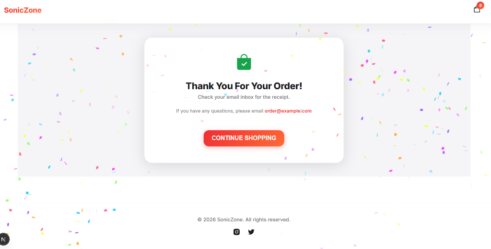
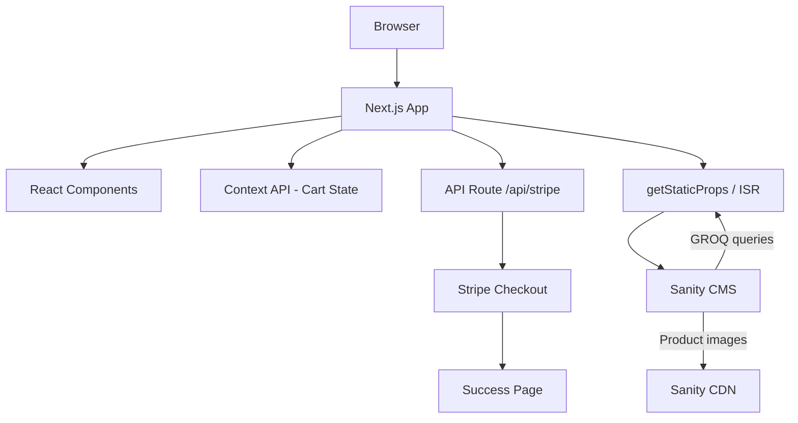
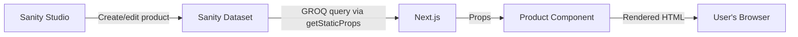

# SonicZone

SonicZone is a full-stack ecommerce application for selling audio products — headphones, earbuds, speakers, and neckbands. I built this to learn how a modern online store works end-to-end: fetching product data from a headless CMS, managing cart state on the client, and handling payments through Stripe Checkout. The store content is fully dynamic — products, prices, images, and promotional banners are all managed through Sanity Studio, so nothing is hardcoded in the frontend.

## Tech Stack

| Technology | Purpose |
|---|---|
| [Next.js](https://nextjs.org/) | Framework — routing, SSG/ISR, API routes |
| [React](https://react.dev/) | UI components and client-side interactivity |
| [Sanity](https://www.sanity.io/) | Headless CMS for products and banners |
| [Stripe](https://stripe.com/) | Payment processing via Checkout Sessions |
| CSS | Styling and responsive layout |
| [Vercel](https://vercel.com/) | Deployment platform |

## Features

- **Dynamic product catalog** — Products are fetched from Sanity CMS using GROQ queries. Adding a new product in Sanity Studio makes it appear on the site without any code change.
- **Product search** — Real-time search bar on the homepage with debounced input (300ms) that filters products by name and description as you type.
- **Product detail pages** — Each product gets its own page at `/product/[slug]` with multiple image thumbnails (hover to switch), description, price, and star ratings.
- **Shopping cart** — Slide-out cart drawer with add/remove items, per-item quantity controls (+/-), and live subtotal calculation. Cart state is shared across all components using React Context.
- **Stripe Checkout** — Cart items are sent to a Next.js API route which creates a Stripe Checkout Session. The user is redirected to Stripe's hosted payment page. No credit card data ever touches our server.
- **CMS-managed banners** — The hero banner and footer promotional banner pull their text, images, and CTA buttons directly from Sanity, so the store owner can run different promotions without deploying.
- **Product recommendations** — A "You may also like" section on every product page shows other products in a CSS marquee animation.
- **Subtle animations** — Sections and product cards fade in with a smooth `fadeInUp` CSS animation on page load for a polished feel.
- **Success page** — After payment, the user lands on a confirmation page with a confetti animation (canvas-confetti) and the cart is cleared.
- **Toast notifications** — Feedback messages when items are added to cart using react-hot-toast.
- **Responsive design** — Layout adapts to desktop, tablet, and mobile using CSS media queries.

## Screenshots

<!-- Add your own screenshots after setting up Sanity and Stripe credentials.
     Save them in docs/screenshots/ and uncomment the table below.

| Homepage | Product Detail |
|---|---|
|  |  |

| Cart | Success Page |
|---|---|
|  |  |
-->

## Architecture



The frontend is a Next.js application using the Pages Router. At build time (and every 60 seconds via ISR), it fetches product and banner data from Sanity using GROQ queries. The React components render this data and manage cart state through Context API. When the user checks out, the cart is sent to a Next.js API route that creates a Stripe Checkout Session on the server side, and the user is redirected to Stripe's hosted payment page.

## How It Works

### Product Data Flow



Products are defined in Sanity with fields for name, slug, price, details, and an array of images. The homepage fetches all products with `*[_type == "product"]`. Product detail pages use `getStaticPaths` to generate a page for each slug, then `getStaticProps` to fetch the individual product data.

### Cart Flow

```mermaid
flowchart LR
    A[Product Page] -->|onAdd| B[StateContext]
    B -->|cartItems, totalPrice, totalQuantities| C[Cart Drawer]
    C -->|toggleCartItemQuanitity| B
    C -->|onRemove| B
    C -->|handleCheckout| D[/api/stripe]
```

When a user clicks "Add to Cart", the `onAdd` function in StateContext checks if the product is already in the cart. If it is, the quantity is updated. If not, the product is added with the selected quantity. The cart drawer reads `cartItems`, `totalPrice`, and `totalQuantities` from context and renders them. Quantity controls call `toggleCartItemQuanitity` which filters out the product, updates its quantity, and spreads it back into the array.

### Checkout Flow

1. User clicks "Pay with Stripe" in the cart
2. `handleCheckout` in `Cart.jsx` loads the Stripe SDK (singleton pattern — only loaded once)
3. Cart items are POSTed to `/api/stripe`
4. The API route maps each cart item into a Stripe line item, converting Sanity image references into CDN URLs
5. A Stripe Checkout Session is created with line items, shipping options, and redirect URLs
6. The session ID is returned and `stripe.redirectToCheckout()` sends the user to Stripe's hosted page
7. After payment, Stripe redirects to `/success` where the cart is cleared and confetti fires

The `STRIPE_SECRET_KEY` is only used server-side in the API route — it never reaches the browser.

> **Note:** This project does not implement Stripe webhooks, order persistence, or payment verification. After Stripe redirects back to the success page, there's no server-side confirmation that the payment actually completed. This would be needed for a real production store.

## Project Structure

```
SonicZone/
├── components/
│   ├── Cart.jsx              # Slide-out cart with checkout
│   ├── Footer.jsx            # Site footer
│   ├── FooterBanner.jsx      # CMS-driven promotional banner
│   ├── HeroBanner.jsx        # CMS-driven hero section
│   ├── Layout.jsx            # Page wrapper (Navbar + Footer)
│   ├── Navbar.jsx            # Logo + cart icon with badge
│   ├── Product.jsx           # Product card for grid listings
│   └── index.js              # Barrel exports
│
├── context/
│   └── StateContext.js       # React Context for cart state
│
├── lib/
│   ├── client.js             # Sanity client + image URL builder
│   ├── getStripe.js          # Stripe SDK loader (singleton)
│   └── utils.js              # Confetti animation for success page
│
├── pages/
│   ├── api/
│   │   └── stripe.js         # Stripe Checkout Session creation
│   ├── product/
│   │   └── [slug].js         # Dynamic product detail pages
│   ├── _app.js               # App wrapper — Context + Layout + Toaster
│   ├── _document.js          # HTML document customization
│   ├── index.js              # Homepage — products + banners
│   └── success.js            # Post-payment confirmation
│
├── sanity_ecommerce/         # Sanity Studio project
│   └── schemaTypes/
│       ├── product.js        # Product schema (name, slug, price, details, images)
│       └── banner.js         # Banner schema (texts, image, CTA, discount info)
│
├── styles/
│   └── globals.css           # All application styles
│
├── .env                      # Environment variables (gitignored)
├── next.config.mjs           # Next.js config
└── package.json
```

## State Management

Cart state is handled through React Context so that product pages, the navbar badge, and the cart drawer can all access the same data without passing it through multiple levels of props.

`StateContext.js` creates a context provider that wraps the entire app in `_app.js`. It exposes:

```
StateContext
├── showCart / setShowCart          → toggles the cart drawer
├── cartItems / setCartItems       → array of products in cart
├── totalPrice / setTotalPrice     → running dollar total
├── totalQuantities                → number shown on cart badge
├── qty / incQty / decQty          → quantity selector on product pages
├── onAdd(product, qty)            → adds product to cart, handles duplicates
├── onRemove(product)              → removes product entirely
└── toggleCartItemQuanitity(id, value)  → increments or decrements per-item qty
```

Any component that needs cart data calls `useStateContext()` to access the shared state. For example, `Navbar.jsx` reads `totalQuantities` to show the badge count, `Cart.jsx` reads `cartItems` to render the list, and product pages use `onAdd` to add items.

This approach works well for this project because the cart state is simple (a few arrays and numbers) and doesn't need the overhead of Redux or Zustand.

## Sanity CMS

The Sanity Studio project lives in `sanity_ecommerce/`. It defines two document types:

**Product** — `name`, `slug` (auto-generated from name), `price`, `details`, and `image` (array of images with hotspot support for responsive cropping).

**Banner** — `image`, `buttonText`, `product` (links to a product slug), `desc`, `smallText`, `midText`, `largeText1`, `largeText2`, `discount`, `saleTime`. The hero banner and footer banner both pull from this schema, so the store owner can change promotional text, swap the featured product, or update the banner image from Sanity Studio.

The frontend fetches this data using GROQ (Sanity's query language). Product images are served through Sanity's CDN via the `@sanity/image-url` builder, so they're optimized and cached automatically.

The practical benefit: if you want to add a new product or change a sale banner, you do it in Sanity Studio — no code changes, no redeployment needed.

## Stripe Checkout

The payment integration uses Stripe's Checkout Sessions API. Here's what the `/api/stripe` route actually does:

```javascript
// Simplified version of what happens in pages/api/stripe.js

// 1. Each cart item is mapped to a Stripe line item
line_items: req.body.map((item) => ({
  price_data: {
    currency: 'usd',
    product_data: {
      name: item.name,
      images: [convertSanityImageToURL(item.image)],
    },
    unit_amount: item.price * 100,  // Stripe uses cents
  },
  adjustable_quantity: { enabled: true, minimum: 1 },
  quantity: item.quantity,
}))

// 2. Session is created with shipping options and redirects
const session = await stripe.checkout.sessions.create({
  submit_type: 'pay',
  mode: 'payment',
  payment_method_types: ['card'],
  billing_address_collection: 'auto',
  shipping_options: [/* free and fast shipping rates */],
  line_items,
  success_url: `${origin}/success`,
  cancel_url: `${origin}/`,
});
```

One thing worth noting: Sanity stores image references as strings like `image-abc123-webp`. The API route has to transform these into actual CDN URLs (`https://cdn.sanity.io/images/...`) because Stripe needs a publicly accessible image URL for its checkout page.

Two shipping options are configured as pre-created Stripe Shipping Rates.

## Rendering Strategy

| Approach | Where it's used |
|---|---|
| **Server-Side Rendering (SSR)** | Homepage (`getServerSideProps`) — fresh data on every request |
| **Static Generation (SSG)** | Product pages (`getStaticProps` + `getStaticPaths`) |
| **Dynamic routing** | Product detail pages use `[slug].js` with `fallback: 'blocking'` |
| **API Routes** | `/api/stripe` handles Checkout Session creation server-side |
| **Client-side state** | Shopping cart, quantity selection, cart drawer toggle |

The homepage uses `getServerSideProps` so product and banner data is always fresh on every page load — no stale content. Product detail pages use `getStaticProps` with `getStaticPaths` and `fallback: 'blocking'`, meaning pages are pre-rendered at build time, and any new product slug added later is server-rendered on first request and then cached.

## Responsive Design

The layout adjusts at two main breakpoints defined in `globals.css`:

- **Below 800px** — Hero banner and footer banner resize, text scales down, product detail page stacks vertically (flex-wrap), cart drawer narrows, marquee speed increases for smaller viewport
- **Below 600px (implicit via 800px styles)** — Cart and product detail further compact, buttons resize

The CSS uses flexbox throughout with `flex-wrap` for the product grid and `@media` queries for the breakpoints. No CSS framework is used.

## Performance

A few things that help with page load times:

- **Sanity CDN** — `useCdn: true` in the Sanity client config means product images and data are served from Sanity's edge network
- **Stripe SDK singleton** — `getStripe.js` uses a module-level variable to ensure Stripe is only loaded once, not re-fetched on every checkout attempt
- **CSS animations** — The marquee uses `will-change: transform` so the browser can GPU-accelerate it. Other page elements use lightweight `fadeInUp` keyframe animations
- **Debounced search** — The product search input is debounced by 300ms to avoid unnecessary re-renders while the user is still typing

## Environment Variables

Create a `.env` file in the project root with:

```env
NEXT_PUBLIC_SANITY_TOKEN=       # Sanity API token (read access)
NEXT_PUBLIC_STRIPE_PUBLISHABLE_KEY=  # Stripe publishable key (safe for client)
STRIPE_SECRET_KEY=              # Stripe secret key (server-side only)
```

- `NEXT_PUBLIC_*` variables are exposed to the browser — this is fine for the Sanity read token and Stripe publishable key, which are designed to be public.
- `STRIPE_SECRET_KEY` is only available server-side (in API routes). It should never be prefixed with `NEXT_PUBLIC_`.

## Getting Started

```bash
# Clone the repository
git clone https://github.com/saketmathur04/EternoStore.git
cd EternoStore

# Install dependencies
npm install

# Set up environment variables
# Create a .env file and add your Sanity and Stripe keys (see above)

# Start the development server
npm run dev
```

The app will be available at `http://localhost:3000`.

### Sanity Setup

The Sanity Studio project is in `sanity_ecommerce/`. To manage your store content:

```bash
cd sanity_ecommerce
npm install
npx sanity dev
```

This opens Sanity Studio where you can create products and banners.

### Production Build

```bash
npm run build
npm start
```

## Key Engineering Decisions

**Why Next.js?**
Next.js gave me file-based routing (no React Router setup), built-in SSG/ISR for fast page loads, and API routes so I could put the Stripe logic in the same project without setting up a separate backend server. The Pages Router was the most documented approach when I started this project.

**Why Sanity?**
Initially I had product data hardcoded in JSON files. Sanity let me move that to a proper CMS where I can update products, change images, and edit banner text through a dashboard. The GROQ query language is more flexible than REST for fetching exactly the fields I need.

**Why React Context for state?**
The cart needs to be accessible from the navbar (badge count), product pages (add to cart), and the cart drawer (item list, quantities, checkout). Context avoids passing cart props through Layout → Navbar → Cart manually. For this use case — a handful of state values and a few update functions — Context is straightforward enough. Redux would be overkill here.

**Why Stripe Checkout instead of a custom payment form?**
Stripe's hosted checkout page handles all the payment UI, card validation, 3D Secure, and PCI compliance. Building a custom payment form would mean handling sensitive card data directly, which I didn't want to deal with for a portfolio project.

**Why ISR with revalidate: 60?**
Pure SSG would require a redeploy every time I update a product in Sanity. SSR would hit the Sanity API on every page load. ISR is the middle ground — pages are cached and served instantly, but refreshed in the background every 60 seconds so changes show up reasonably quickly.

## What I Learned

This project helped me get hands-on with:

- Structuring a Next.js app with the Pages Router, including dynamic routes and API routes
- Working with a headless CMS (Sanity) — defining schemas, writing GROQ queries, and using the image URL builder
- Managing shared client-side state with React Context and `useContext`
- Integrating Stripe's server-side Checkout Sessions API and understanding why secret keys must stay on the server
- Understanding the differences between SSG, SSR, and ISR, and when each makes sense
- Building responsive layouts with vanilla CSS and media queries
- Structuring React components so they're reusable (Product card, banners, Layout wrapper)

## Future Improvements

Things I'd add if I continue working on this:

- **Persistent cart** — Right now the cart is lost on page refresh. Could use localStorage or a database.
- **User authentication** — Login/signup so users can track past orders
- **Order persistence** — Save orders to a database after payment instead of just showing a success page
- **Stripe webhooks** — Verify payment completion server-side instead of trusting the redirect
- **Category filtering** — Let users filter products by category, price range, etc.
- **Wishlist** — Save products for later
- **Inventory management** — Track stock and prevent overselling
- **Reviews** — Let users rate and review products

## Author

**Saket Mathur**

BTech Computer Science — 4th Year

[GitHub](https://github.com/saketmathur04)
